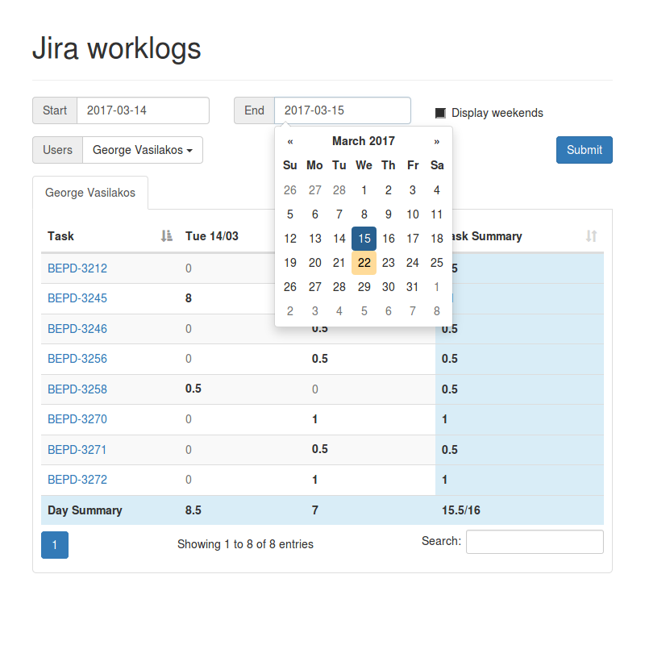

## Jira Worklogs

A draft PHP script to display the tasks worked and their duration for the selected dates using Jira worklogs.
You have to enable the [jira-worklog-query-plugin](https://github.com/everit-org/jira-worklog-query-plugin) at 
your Jira installation in order for the script to fetch the worklogs.

### Configuration
You have to set `USERNAME`, `PASSWORD` and `AVAILABLE_USERS` at the [`config.php`](config.php) file.

### Screenshots

